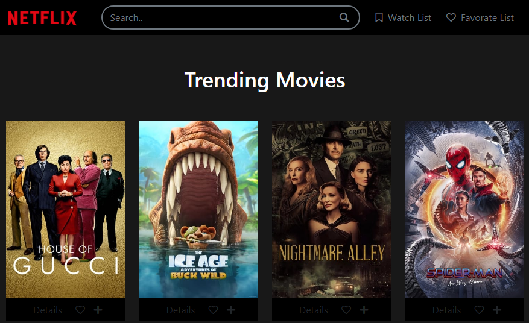
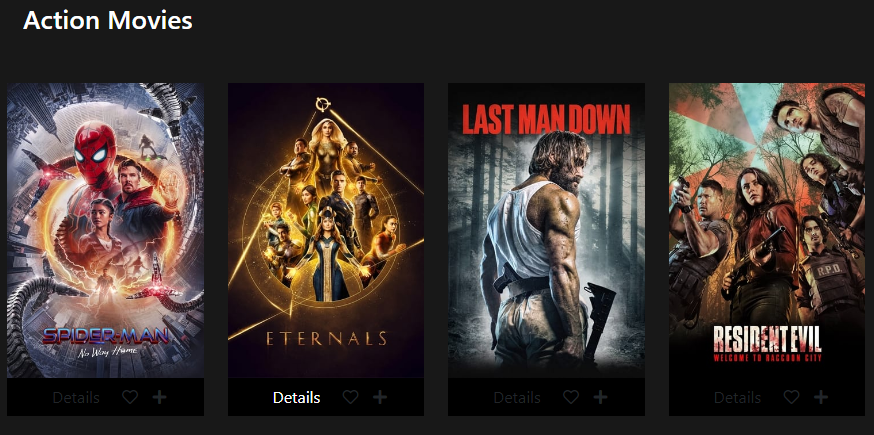
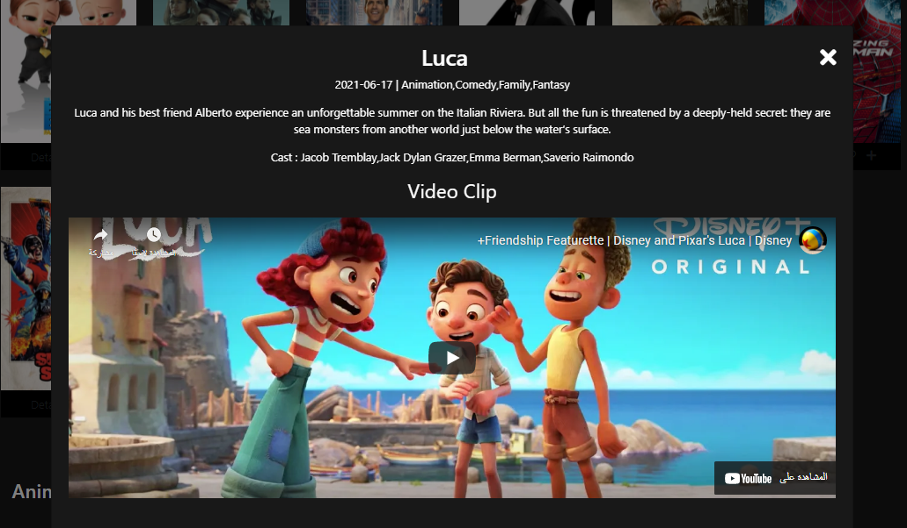

#  Movies Website

## Introduction
A simple movies website, If you like movies, this website will be useful to you, as it provides you with a list of movies and you can search for all kinds of movies that you want. Simply type the movie name in the search box, and will appear for you. You can add movies to your favorites or watch list later. As you can rating movies.

### Technologies Used:
* HTML
* CSS
* Vanilla Javascript
* Bootstrap
* [Fontawesome](https://fontawesome.com/)
* [Axios](https://axios-http.com/)
* [The Movie DB API](https://www.themoviedb.org/)

## Project Functions:
- Design Responsive Website by Bootstrap.
- Axios Movies from [The Movie DB API](https://www.themoviedb.org/).
- Display All Movies information( title, Poster, publisher... etc) on Front End Cards.
- Categorize Movies into Categories.
- Allow users to Search for Movies by name.
- Allow users to add movies into favorite list.
- Allow users to remove movies from favorite list.
- Allow users to add movies into watch later list.
- Allow users to remove movies from watch later list.

## Screenshots:

## Live preview
Check out the demo page [Live Preview]()